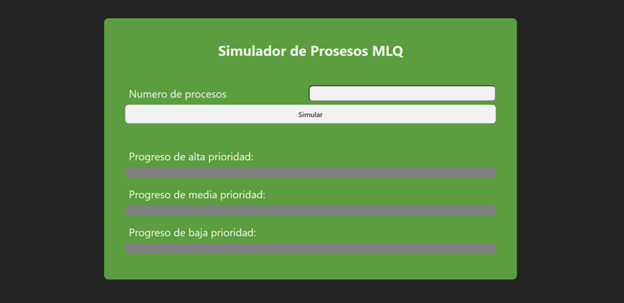
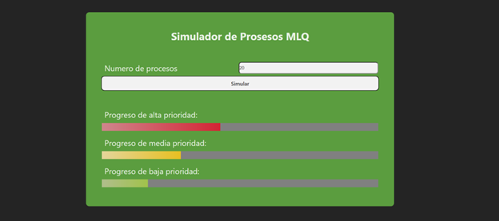

# Planificador MLQ (Cola Múltiple ) React + Vite

💡 El algoritmo de planificación MLQ (Multiple Level Queue) o "Cola Múltiple". Es un algoritmo de planificación utilizado en sistemas operativos para administrar la ejecución de procesos. El algoritmo MLQ organiza los procesos en varias colas o niveles, y cada cola tiene una prioridad distinta. Los procesos se asignan a una cola en función de su prioridad, y luego se planifican para su ejecución en función de su cola correspondiente.

1. ☘️ El programa pregunta el número de procesos iniciales y al presionar el botón de simular trabajos se generan de manera aleatoria.

2. 🌿 Después de presionar el botón, se ejecutan trabajos usando el algoritmo MLQ para los procesos, y las colas de prioridad

----------------------------------------------

Edwin Cornejo 👨🏻‍💻💚.