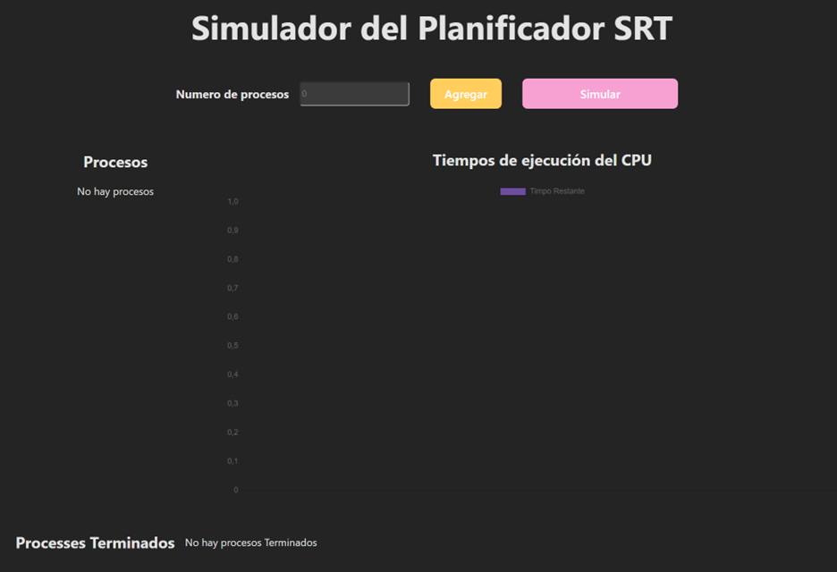
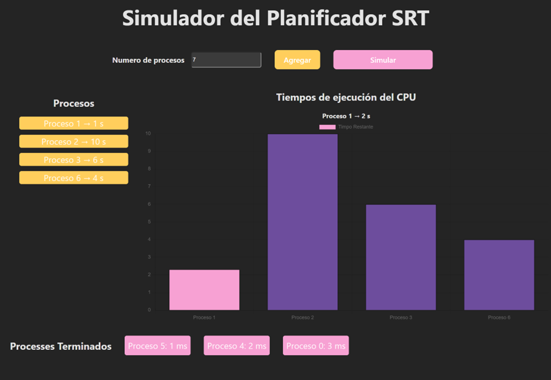
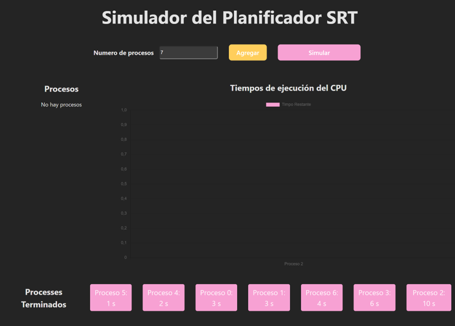

# Planificador SRT (Shortest Remaining Time) React + Vite

Su característica distintiva es la selección basada en el tiempo restante; prioriza el proceso con el tiempo restante más corto para completarse en lugar de considerar prioridades o tiempos de llegada. Esta elección se realiza de forma continua, con actualizaciones periódicas de las estimaciones de tiempo restante a medida que un proceso se ejecuta. 

1. 🌿 El programa pregunta el número de procesos iniciales y al presionar el botón de agregar trabajos se generan de manera aleatoria.

    

2. ☘️ después al presionar el botón de ejecutar trabajos procede a ejecutar el algoritmo SRT para los procesos.

    

3. 🌱 Aquí se muestra el programa durante la ejecución. 

    

4. 🪴Al terminar de ejecutar todos los procesos se muestran todos en la parte de Procesos terminados, en el orden en el que se ejecutaron los procesos.

    

--------------------------------------------

Edwin Cornejo 👨🏻‍💻💚.